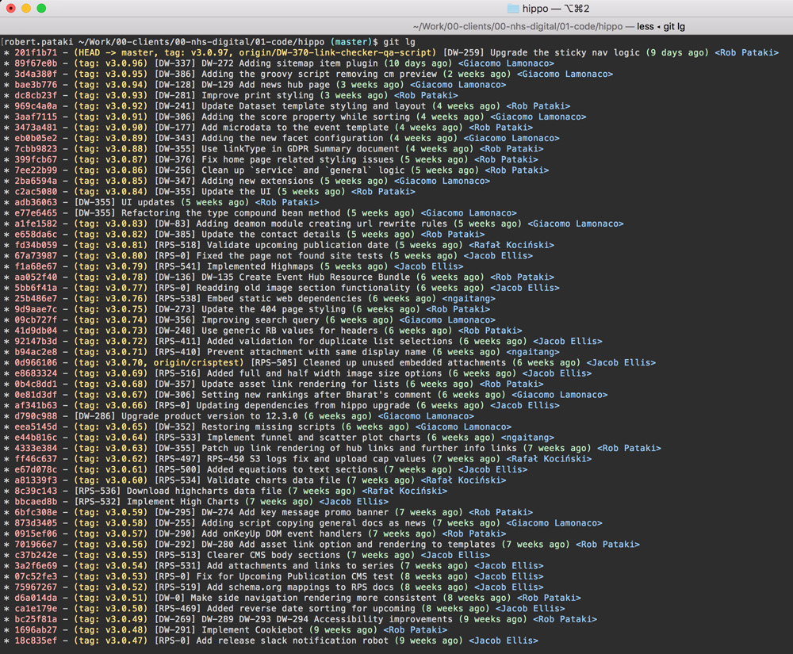

# How to / Git

## Branching strategy

We use a form of **Git flow** to maintain a stable `master` branch, and work off feature branches to introduce new features and other code updates. The feature branches are tied to JIRA tickets.

To keep our **git log** clean and tidy we use git's **rebase** strategy. That means that instead of merging commits in and out of the master branch (resulting in many ugly merge commits) we always keep our own feature branch's commits on top of the existing master branch commits.

This is the ind of git log we'd expect:




You can read more about the rebase strategy here: [https://www.atlassian.com/git/tutorials/merging-vs-rebasing](https://www.atlassian.com/git/tutorials/merging-vs-rebasing).

If you're not familiar with the rebase strategy don't worry - below you'll find the detailed steps to get the job done with git :)

## Writing Git commit messages

When writing the git commit message, please stick to a maximum of 72 characters length for both the subject line and the message itself.

The subject line should start with the JIRA ID of the appropriate ticket it belongs to, and it should summarise what the code changes do.

When squashing the commits of a feature branch into a single commit, please make sure that the commit message explains what the code updates do.

Here is an example:

```
[DJC-9] Add 'Worked outside UK' section

The 'Worked outside UK' section asks the claimant questions about 
whether or not he/she claimed any benefits whilst living in an EEA 
country.
```

> If in doubt about the formatting, just check the previous commit messages on the master branch.
> If still in doubt, check out [this document](https://gist.github.com/robertpainsi/b632364184e70900af4ab688decf6f53).


## Merging strategy

We use `rebase` strategy when merging code in. Once a feature branch is complete, we squash all commits on it into 1 meaningful commit (rebasing on top os `master` branch), then merge the feature branch's single commit into `master` branch.

Please refer to the following steps

## Working on feature branches

### Step 1 - Checkout `master` branch
```
$ git checkout master
$ git pull --rebase origin master
```

> The `git pull --rebase` command makes sure that you local `master` branch is aligned with the remote `master` branch.

### Step 2 - Create a new feature branch
```
$ git branch DJC-XX-my-feature
$ git checkout DJC-XX-my-feature
```

> Note how we use the Jira ticket ID to clearly identify the code changes with the relevant business requirement.

**Make changes, create new commits, work work work...**

### Step 3 - Push your work to remote

Just in case your laptop gets swallowed up by a black hole :)

```
$ git pull --rebase origin DJC-XX-my-feature
```
First pull the latest updates of the branch from origin (only have to do this if someone else is also working on the branch and might have pushed updates to origin), then push your changes to the `origin`.

```
$ git push origin DJC-XX-my-feature
```


## When your feature is ready

Once a feature branch is complete, tested, and approved by the PO, you can go ahead and merge it into the master `branch`.

To keep the git log consistently clean and tidy, we squash the commits of each feature branch into a single commit.

```
$ git checkout DJC-XX-my-feature
$ git fetch --prune
$ git pull --rebase origin master
```

Make sure you update your feature branch with the latest version of the `master` branch; then you can squash your commits using interactive rebasing: 

```
$ git rebase -i origin/master
```

Once you're done, do...

```
$ git commit --amend
```

...to edit your final commit's message and subject line (make sure you follow our **git commit message guidelines** above).

Once you're done with squashing, once again push your updates to remote `origin`, and make a new pull request on Github.


## Feature branch => DONE (=> PR) => merge into master

Every new PR should be peer-reviewed. Once the PR was approved by the reviewer, the PR can be merged into `master` branch.

```
$ git checkout master
$ git fetch --prune
$ git pull --rebase origin master
$ git merge DJC-XX-my-feature
$ git push origin master
```

Once a feature branch was merged into master, it should be deleted.